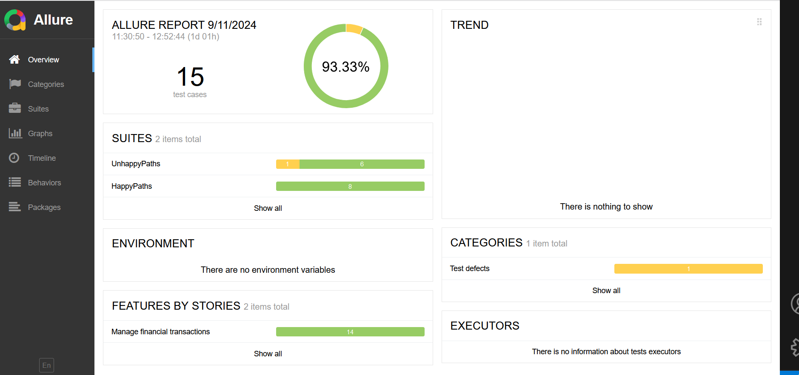

# MangopayQaApiChallenge

## Acceptance Criteria and Test Cases
Acceptance Criteria file can be found here [AcceptanceCritera.md](https://github.com/fszymaniak/MangopayQaApiChallenge/blob/main/AcceptanceCritera.md)  
Test Cases files can be found in the [TestCases folder](https://github.com/fszymaniak/MangopayQaApiChallenge/tree/main/TestCases)  

## How to setup the tests

### Create local repository
Choose the local repository directory and open git bash or cmd.
Please clone the repo using git clone command
`git clone https://github.com/fszymaniak/MangopayQaApiChallenge.git`

### Secrets
In order to properly run the tests you have to provide cliend Id and client password (API key). 
If you do not have there please check first prerequisites' bullet point in the [Postman Introduction page.](https://docs.mangopay.com/postman#introduction)

If you have both valid credentials you can update them in the appsettings.json or override using secrets.json.

#### Updating secrets in the appsettings.json

Go to the tests folder and in the [appsettings.json](https://github.com/fszymaniak/MangopayQaApiChallenge/blob/main/tests/MangopayQaApiChallenge.Tests.Api/appsettings.json) update values "CLIENT_ID" and "API_KEY"

### Overriding secrets using secrets.json
#### Visual Studio
Click right on the MangopayQaApiChallenge.Tests.Api project then search for "Manage User Secrets" then secrets.json should open.

#### Rider
Click right on the MangopayQaApiChallenge.Tests.Api project then Tools then ".NET User Secrets"

#### Secrets.json setup
Secrets.json file has been created in your local folder outside the repository.
In order to setup it properly you have to get full path of the file and retrive from it parent folder name which is in GUID format e.g. 54cb8fce-d12f-4191-a3c6-b150c45ebf9f

When you have this GUID foler name you have to update it in the [MangopayQaApiChallenge.Tests.Api.csproj](https://github.com/fszymaniak/MangopayQaApiChallenge/blob/main/tests/MangopayQaApiChallenge.Tests.Api/MangopayQaApiChallenge.Tests.Api.csproj) line: `<UserSecretsId>GUID_TO_UPDATE</UserSecretsId>`

After that please copy appsettings.json into secrets.json and update the values to the valid ones.

## Running the tests
Tests can be found inside the Test folder in the MangopayQaApiChallenge.Tests.Api project [here](https://github.com/fszymaniak/MangopayQaApiChallenge/tree/main/tests/MangopayQaApiChallenge.Tests.Api/Tests)

### From the IDE
Open your IDE, build the project and then from the Test Explorer (Visual Studio) or Unit Tests window (Rider) you can click on them and run all or selected ones.

### From the command line
Open your IDE, go to the command line and run:
`dotnet build`
then
`dotnet test`

### Allure reports
When the tests are finished then Allure reports are available in the following directory (as json formats)
`\tests\MangopayQaApiChallenge.Tests.Api\bin\Debug\net6.0\allure-results`

In order to view the html report you have to go to the .net6.0 folder
`\tests\MangopayQaApiChallenge.Tests.Api\bin\Debug\net6.0`
then open cmd in this folder 
and after that run
`allure serve allure-results`

As a result the local index.html web page with reports should be visible:

### What can be added/improved
- adding logging
- add some contract tests
- add E2E flow for the whole User Story
- dockerize the project
- setup CI pipeline
- dependency injection for Nunit